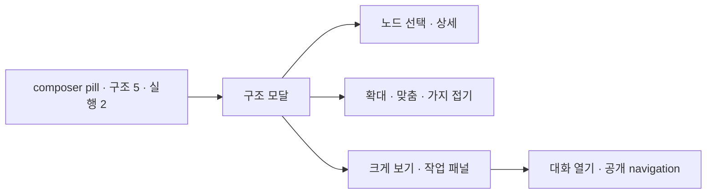
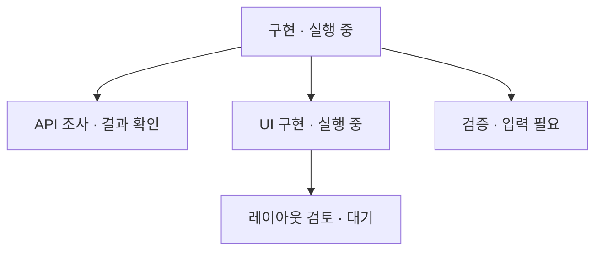
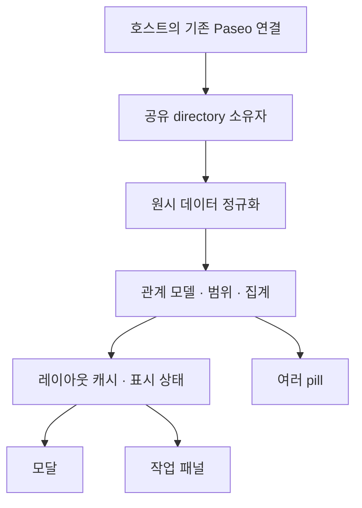

# agent-graph 구현 계획

2026-10-06 구현 요청에 따라 0.1.0을 구현하고 로컬 설치했다. 아래는 최초 설계 기준이며, 확정한 변경과 검증 결과는 [DECISIONS](DECISIONS.md), [VALIDATION](VALIDATION.md)을 따른다.

작성일: 2026-10-06

상태: 0.1.1 정적 D3 force 배치와 드래그·검색 개선을 로컬 반영했다. 사용자의 많은 subagent 탐색 불편과 D3 전환 요청에 따라 초기 계층 배치·75% 최소 배율·드래그 제외안을 변경했다. 아래 초기 설계와 달라진 내용은 DECISIONS 6절과 VALIDATION의 후속 검증을 따른다.

위치: `01-works/paseo-plugin/agent-graph/`

기준 환경: Paseo CLI·daemon·SDK 0.10.2

## 1. 목적과 범위

현재 대화에서 부모 에이전트와 하위 에이전트의 구조를 자주 확인할 수 있도록 한다.
mac-monitor처럼 composer pill에서 즉시 열고, 구조가 커지면 확대·접기 또는 큰 작업 패널을 사용한다.

사용자가 정한 방향은 **Paseo 에이전트만 표시**, **pill을 주 진입점으로 사용**, **확대 가능한 구조 보기**다.
첫 버전은 관찰과 대화 이동에 집중한다. 에이전트 생성·종료·중단·메시지 전송·권한 승인은 포함하지 않는다.
다른 호스트의 관계를 합치거나 provider 내부 하위 에이전트를 별도로 수집하지 않는다.

연결선은 Paseo에 기록된 부모·자식 관계를 뜻한다. 작업 의존성이나 메시지 흐름으로 해석하지 않는다.
루트라는 이유만으로 `supervisor`라는 역할을 붙이지 않는다. `idle`도 작업 완료로 단정하지 않는다.

## 2. 레퍼런스와 채택 방향

| 레퍼런스 | 참고할 점 | 이번 계획의 선택 |
|---|---|---|
| [Agent Crew](REFERENCES.md#1-agent-crew) | 부모·자식 관계, 다른 workspace의 자식 포함, 조상 문맥, 상태와 부분 결과 | 관계 정규화와 범위 규칙을 참고한다. Explorer 목록 대신 pill과 그래프를 주 화면으로 둔다. |
| [mac-monitor](REFERENCES.md#2-mac-monitor) | 짧은 pill, 캐시로 즉시 열기, 라벨 갱신과 모달 수명 분리, portal 클릭 회귀 수정 | 같은 접근·수명 패턴을 사용한다. 2초 측정 폴링은 가져오지 않는다. |
| [Paseo 0.10.2](REFERENCES.md#3-paseo-0102-api) | 공개 에이전트 목록·구독, composer pill, Modal, 작업 패널 | client 전용 플러그인으로 구현한다. 설치된 타입을 우선한다. |

Agent Crew의 상태별 형제 정렬은 그래프에 사용하지 않는다. 실행 상태가 바뀔 때 노드 위치가 움직이기 때문이다.
코드는 독립적으로 구현하되 상당량의 Agent Crew 소스를 재사용하면 MIT 저작권·라이선스 고지를 보존한다.

## 3. 기본 사용 흐름



### 3.1 Pill

- workspace가 있는 Paseo 에이전트에 등록한다. 에이전트 목록과 관계 모델을 다른 화면과 공유한다.
- 기본 라벨은 `구조 5 · 실행 2`다. 현재 에이전트가 포함된 관계 트리의 실제 노드 수와 `running` 수를 뜻한다.
- 시작 중·입력 필요·오류 등의 세부 상태는 모달에서 표시한다. 초기 조회 전에는 `구조 …`로 표시한다.
- 불완전하거나 끊긴 데이터는 정상 숫자로 단정하지 않는다. 짧은 표시와 상세 경고를 함께 둔다.
- Paseo의 pill 폭 제한 160px를 고려한다. 큰 숫자·compact에서는 `구조 N`까지 축약하고 전체 값은 모달에 둔다.
- 라벨이 달라질 때만 `registration.update({ label })`를 호출한다. 갱신마다 pill을 제거·재등록하지 않는다.
- title은 `에이전트 구조`처럼 짧게 한다. 긴 설명 툴팁이나 계속 바뀌는 툴팁을 추가하지 않는다.

### 3.2 모달과 표시 범위

상단에는 `현재 구조 / workspace` 범위 전환과 `크게 보기`를 둔다.
그 아래에 확대·축소·화면 맞춤·현재 에이전트 찾기, 구조 영역, 선택한 노드의 상세를 배치한다.
기본 폰트 크기와 작은 수의 테마 색만 사용하며, 반복 안내 문구와 장식용 애니메이션은 넣지 않는다.

| 범위 | 포함되는 노드 |
|---|---|
| 현재 구조 — 기본 | 현재 에이전트에서 부모를 따라 찾은 루트와 그 아래의 확인 가능한 전체 자손. 같은 호스트의 다른 workspace 자손도 포함한다. |
| workspace | 해당 workspace의 에이전트와 자손, 관계를 이해하는 데 필요한 외부 조상. 관련 없는 다른 workspace 형제 가지는 제외한다. |

캐시가 있으면 열자마자 보여준다. 최신 상태를 받는 동안 전체 화면을 로딩 화면으로 바꾸지 않는다.
처음 데이터가 없는 경우에도 구조 영역의 높이를 확보해 결과 도착 시 창 크기가 급변하지 않게 한다.
데스크톱은 모달, compact는 호스트의 시트로 열며, 내부 구조 영역은 별도 스크롤을 사용한다.

### 3.3 노드와 상세

- 노드에는 이름 최대 두 줄과 상태를 표시한다. 이름이 없으면 provider와 짧은 ID를 사용한다.
- 현재 대화의 노드는 테두리로, 선택한 노드는 별도의 선택 표시로 구분한다. 상태 색과 혼용하지 않는다.
- 자식이 있는 노드에는 접기 버튼과 숨겨진 자식 수를 둔다. 노드 선택과 접기 클릭을 분리한다.
- 상세에는 전체 이름, 상태, provider·model, workspace, 부모, ID를 표시한다. 선택한 항목이 없으면 비워 둔다.
- 길어진 상세는 그래프 높이를 계속 줄이지 않도록 높이 제한과 내부 스크롤을 둔다.
- 상태는 색과 텍스트를 함께 표시한다. 진행률이나 완료 비율을 만들어 내지 않는다.

계층 배치 예시다. 아래 이름과 상태는 합성 데이터이며 연결선은 부모·자식 관계만 나타낸다.



### 3.4 확대와 큰 보기

확대는 그래프 배율 변경이고, `크게 보기`는 workspace 작업 패널로 이동하는 동작이다.
0.10.2의 공개 Modal에는 크기·전체 화면 옵션이 없으므로 모달 전체 화면을 약속하지 않는다.

- 확대 기본값 100%, 제안 범위 75~150%, 버튼 단위 25%. 정확한 범위는 실제 폰트·터치 검증으로 확정한다.
- 화면 맞춤은 읽을 수 있는 최소 배율까지만 줄인다. 큰 트리는 글자를 계속 축소하지 않고 스크롤·접기를 사용한다.
- 시각적 배율과 스크롤 가능한 콘텐츠 크기를 함께 계산한다. CSS transform만 적용해 끝 노드가 잘리는 구현은 피한다.
- 패널은 `addWorkspacePanel`의 `context: "agent"`, `locations: ["workspace"]`로 등록한다.
- `client.openPanel(..., { workspaceId, agentId, location: "workspace" })`로 연다.
- 모달과 패널은 선택·접힌 가지·범위를 공유한다. 배율·스크롤은 서로 다른 뷰 크기에 맞춰 복원하거나 보정한다.
- 패널에는 공개 `navigation.openAgent`가 있을 때 `대화 열기`를 제공한다. 버튼 아이콘/모달 props에는 navigation이 없으므로 동일 기능이 된다고 가정하지 않는다.
- compact에서 패널 전환이 지원되지 않거나 실패하면 현재 시트를 유지한다. 그 안에서 접을 수 있는 트리를 계속 사용할 수 있어야 한다.

### 3.5 Compact와 조작 안정성

compact의 기본값은 들여쓰기 기반 접이식 트리다. 그래프는 데스크톱 기본으로 제공한다.
핵심은 작은 화면에서도 이름과 상태를 읽는 것이다. 자유로운 드래그·핀치 조작은 첫 버전에서 제외한다.

버튼은 최소 44의 터치 영역을 확보하고, 기본 Text 크기를 유지한다.
선택·접기·확대는 키보드로도 접근 가능하게 하고, Escape·뒤로가기는 호스트 Modal 동작을 따른다.
자동 갱신은 상태와 숫자만 바꾼다. 열린 창, 선택, 접힌 가지, 배율, 스크롤을 초기화하지 않는다.

## 4. 데이터 모델과 의미

### 4.1 관계의 출처

0.10.2의 `paseo.agents.list()` 원시 목록은 `labels["paseo.parent-agent-id"]`에서 부모 ID를 읽는다.
plugin의 정규화된 `PluginAgentSnapshot.parentAgentId`와 원시 목록 타입을 혼동하지 않는다.
이 처리는 `normalize.ts`에 격리한다.

향후 원시 API에 first-class 필드가 생기면, **필드가 존재하는 경우 그 값을 우선**한다.
명시적 `null`은 부모 없음으로 처리하고, 오래된 label로 관계를 되살리지 않는다.
부모 필드가 없는 버전에서만 label로 폴백한다.

노드 ID는 `hostId + agentId`로 구분한다. 다른 호스트의 같은 ID를 연결하지 않는다.
부모가 여러 개인 DAG나 임의 의존성 편집은 지원하지 않는다.

### 4.2 상태

데이터 신선도와 에이전트 상태를 별도로 관리한다. 연결 단절은 에이전트 자체 오류나 완료가 아니다.
유효한 최신 데이터에서 아래 우선순위로 상태를 정규화한다.

| 조건 | 화면 표시 |
|---|---|
| `status === "closed"` | 닫힘. 남은 attention flag로 실행 중처럼 바꾸지 않는다. |
| `status === "error"` 또는 현재 오류 attention | 오류 |
| `providerUnavailable` | 제공자 사용 불가 |
| pending permission 또는 permission attention | 입력 필요 |
| `status === "running"` | 실행 중 |
| `status === "initializing"` | 시작 중 |
| 현재 `requiresAttention`과 finished attention | 결과 확인 |
| `status === "idle"` | 대기 |
| 알 수 없는 값 | 확인 불가 |

attention은 현재 플래그와 함께 해석한다. 과거 `lastError`나 stale attention만으로 새 실행을 오류로 바꾸지 않는다.
`결과 확인`은 결과가 준비되었다는 신호이며 전체 작업 성공·완료를 보증하지 않는다.
Pill의 실행 수는 `running`만 세고 초기화·대기는 별도 상태로 남긴다.

### 4.3 불완전하거나 비정상인 관계

- 없는 부모는 `부모 정보 없음` 문맥 노드로 표시한다. 정상적인 독립 루트로 오인시키지 않는다.
- archived 에이전트는 기본 목록에서 제외한다. 필요한 조상 정보를 사용할 수 없다면 같은 문맥 표시를 사용한다.
- 자기 참조·순환은 방문 집합으로 탐색을 끝내고 문제 연결을 끊어 표시한다. 무한 재귀를 허용하지 않는다.
- 같은 ID의 중복 페이지 결과는 하나로 합친다. 업데이트 버전·조회 세대에 따라 최신 결과를 유지한다.
- workspace 범위에서 제외된 조상은 문맥 노드로만 표시하며, pill의 실제 에이전트 수에 더하지 않는다.
- 자료가 잘리면 `일부만 표시`와 알려진 개수를 표시한다. 없는 관계를 추정해 채우지 않는다.
- 선택한 에이전트가 제거되면 선택을 해제하고 짧은 메시지를 보여준다. 다른 노드를 임의로 선택하지 않는다.

## 5. 구독·캐시·수명

### 5.1 Client 전용 구조



첫 버전은 server entry·native helper·plugin RPC가 필요 없다.
기존 `client.paseo`를 사용하며 추가 인증, 소켓, CLI 실행, 타임라인 수집을 도입하지 않는다.
표시 상태는 플러그인 내부 메모리에 두고 `host/workspace/originAgent`로 구분한다.
실험적 `globalThis` 레지스트리나 파일 저장은 사용하지 않는다.

### 5.2 목록과 구독

- 클라이언트의 각 호스트용 플러그인 인스턴스에 directory 소유자를 하나 둔다. 같은 호스트의 pill·모달·패널은 이를 공유한다.
- `paseo.agents.list({ subscribe: {} })`의 owned subscription으로 초기 snapshot과 update를 받는다.
- `agents.subscribe(handler)`만 호출해 원격 구독이 생긴다고 가정하지 않는다.
- 초기 목록은 페이지당 200, 최대 10페이지/2,000개를 제안 상한으로 한다. 이는 데이터 처리 제한이며 SDK의 전체 에이전트 수 제한이 아니다.
- 최대 페이지에 도달하거나 다음 cursor가 남으면 부분 결과를 명시한다. 실제 현재 에이전트가 범위 밖이라면 로딩 완료로 가장하지 않는다.
- **구현 전 확인:** 구독이 목록 전체를 갱신하는지, 최초 페이지의 window만 갱신하는지 검증한다.
  200개 경계·새 에이전트의 페이지 진입·제거·재연결을 확인하기 전에는 단일 lease로 전체 자료가 최신이라고 선언하지 않는다.
- window 한정이면 공유 소유자 아래 필요한 페이지 lease를 관리하거나, 경계 변화 시 debounce된 재조회로 복구한다.
  선택한 방식과 한계를 DECISIONS에 기록하고, 각 pill이 따로 전체 목록을 조회하지 않도록 한다.
- 상태 update는 ID map에 적용하고 최대 약 250ms 간격으로 화면 알림을 묶는다. 같은 값이면 알리지 않는다.
- 상태 이벤트마다 전체 목록을 다시 받거나 2초 타이머로 목록을 반복 조회하지 않는다.

### 5.3 경합과 연결 복구

초기 조회는 single-flight로 처리한다. 페이지 조회 중 도착한 update를 잃지 않도록 버전 또는 세대 검사를 둔다.
재연결의 authoritative snapshot과 개별 페이지 범위를 구분해 병합하며, 일부 페이지로 전체 map을 지우지 않는다.
부모 label·archive·workspace 변경도 상태 변경과 구분해 모델을 갱신한다.

연결이 끊기면 마지막 구조를 유지하고 `연결 끊김` 또는 `갱신 실패`를 표시한다.
확인되지 않은 최신 실행 수를 0으로 만들지 않는다. 재연결 후 owned subscription의 새 snapshot으로 복구한다.
수동 재시도는 실패·부분 결과를 복구할 때 제공하며 정상 화면의 주 동작으로 두지 않는다.

플러그인 unload/disable 때 listener·timer·구독을 모두 정리한다.
초기 조회가 늦게 끝나더라도 disposed 이후 받은 구독은 release하고 UI에 반영하지 않는다.
빌린 Paseo 연결 자체를 닫지 않는다.

## 6. 그래프 배치와 성능

**0.1.1 변경:** 아래 계층 배치는 최초 구현의 기준이다. 현재는 `d3-force@3.0.0`을 정적 좌표 계산에만 사용한다. 120 tick을 나누어 실행하고 완료 후 멈추며, 상태·제목 갱신에는 캐시를 사용한다. 전체 보기는 점, 확대는 카드, 이동은 드래그·스크롤·이름/ID 검색이다. 렌더링은 계속 RN View이며 DOM·Canvas·SVG·React Flow를 추가하지 않는다. compact는 목록을 유지한다.

부모가 위, 자식이 아래인 트리를 기본으로 한다. 독립 루트는 가로로 나란히 배치한다.
형제 순서는 생성 시각과 ID로 고정하며, 실행 상태·updatedAt·선택 변경으로 순서를 바꾸지 않는다.
노드 폭과 높이는 일정하게 두고 이름은 상세에서 펼쳐 본다.

초기 제안은 노드 176×64, 형제 간격 16, 세대 간격 32다. 실제 기본 폰트와 두 줄 이름을 검토해 확정한다.
레이아웃은 순수 TypeScript 함수로 계산하고 React Native `View`로 노드와 직각 연결선을 그린다.
연결선은 클릭을 가로채지 않도록 한다. DOM·HTML·SVG·Canvas·React Flow 의존성은 사용하지 않는다.

- topology가 바뀌거나 사용자가 가지를 접을 때만 배치를 다시 계산한다. 상태·제목 변경은 기존 좌표를 사용한다.
- topology 변경 때도 현재 선택 노드 또는 보이는 기준 노드의 화면 위치를 보존한다.
- 첫 화면은 현재 에이전트 주변 경로와 가까운 가지가 보이도록 한다. 모든 자손을 무조건 펼쳐 시작하지 않는다.
- 그래프는 동시에 펼쳐진 실제 노드 200개를 제안 상한으로 한다. 더 큰 구조는 가지를 접거나 가상화한 트리 목록으로 본다.
- 접힌 가지의 수는 모델에서 계산한다. 화면 밖 노드에도 모든 RN 뷰를 생성하는 구현은 피한다.
- 전체 모델은 초기 상한 2,000개에서 반복 탐색 비용을 검증한다. 깊은 체인은 재귀 스택 한계를 피한다.
- 기본 확대와 단순 연결선으로 시작한다. force layout·노드 드래그·미니맵·빛나는 애니메이션은 첫 버전에 넣지 않는다.

성능 기준은 **검증 목표**다. idle 시 플러그인 자체 주기 조회 0회, pill 3개에서도 공유 구독만 유지,
상태만 바뀔 때 레이아웃 계산 0회, 창 재개 시 캐시 즉시 표시를 확인한다.
실측 지연·메모리·이벤트 폭주 결과는 구현 뒤 VALIDATION에 기록한다. 지금 부하가 0이라고 주장하지 않는다.

## 7. API와 파일 구조

SDK는 초기 개발에서 0.10.2로 고정하고 manifest의 `requirements.paseo`는 `>=0.10.2 <0.11.0`을 제안한다.
0.11의 `addScreen`·sidebar header 등은 사용하지 않는다. 버전 범위 확대는 별도 검증 후 진행한다.
모든 UI는 React Native 기본 요소·Paseo의 Icon/Modal/ScrollView·theme.colors로 구현한다.
`tsconfig`에 DOM을 넣지 않는다.

아래 구조를 기준으로 구현했다. 공통 UI를 위한 `content.tsx`, `controls.tsx`와 portal·수동 검증 파일도 포함한다.

```text
agent-graph/
├── README.md
├── paseo-plugin.json
├── package.json
├── tsconfig.json
├── index.client.tsx
├── client/
│   ├── directory.ts       # 공유 조회·owned subscription·연결 상태
│   ├── normalize.ts       # 버전별 원시 DTO·부모·상태 해석
│   ├── view-state.ts      # 범위·선택·접기·배율
│   ├── pill.tsx
│   ├── modal.tsx
│   ├── panel.tsx
│   ├── graph.tsx
│   ├── use-force-layout.ts # 제한된 배치 작업·캐시·중단
│   ├── tree.tsx
│   └── details.tsx
├── shared/
│   ├── types.ts
│   ├── forest.ts
│   ├── force-layout.ts    # 정적 D3 좌표 계산
│   └── layout.ts
├── test/
│   ├── forest.test.ts
│   ├── directory.test.ts
│   ├── layout.test.ts
│   └── interaction.test.tsx
└── docs/
    ├── PLAN.md
    ├── REFERENCES.md
    ├── DECISIONS.md        # 구현 중 변경 근거
    └── VALIDATION.md       # 실제 검증과 미검증 범위
```

## 8. 구현 순서

1. **API 검증:** 0.10.2의 200개 경계·구독 범위·reconnect·release를 확인한다.
   pill 모달 클릭이 바깥 action을 재실행하지 않는지, 작업 패널·navigation의 실제 가용성도 확인한다.
2. **모델과 공유 데이터:** 부모·상태 정규화, 범위·순환·부분 결과, single-flight와 구독 cleanup을 구현한다.
3. **Pill과 기본 트리:** 캐시 즉시 표시, 안정적인 모달 수명, compact 접이식 트리, 선택 상세를 만든다.
4. **그래프와 큰 보기:** 일정한 노드 배치, 확대·맞춤·현재 위치 찾기, 패널 전환과 선택 복원을 구현한다.
5. **실화면 검증:** 두 테마·compact·복수 pill·연결 실패·큰 구조를 확인하고 부하와 결과를 기록한다.

작업 중 API 제약으로 계획을 바꾸면 DECISIONS에 근거와 영향 범위를 기록한다.
서버 추가·provider 내부 수집·제어 기능처럼 범위가 커지는 변경은 구현에 포함하기 전에 사용자와 결정한다.
후속 구현 요청으로 로컬 설치·reload·disable/enable 검증까지 진행한다. 이 구현의 GitHub push는 아직 요청되지 않았다.

## 9. 검증과 완료 기준

### 9.1 모델·수명 검증

- [ ] 단일 노드, 여러 루트, 중첩 자손, 다른 workspace의 자손·조상 문맥이 의도대로 표시된다.
- [ ] raw label 폴백과 first-class null 우선순위가 구분된다.
- [ ] 순환·자기 참조·없는 부모·중복 ID·archive·제거를 처리하며 탐색이 종료된다.
- [ ] 대기를 완료로 표시하지 않고, current attention과 과거 오류를 구분한다.
- [ ] 200개 페이지 경계와 상한 초과에서 부분 자료가 정상 전체 자료로 표시되지 않는다.
- [ ] update/페이지 응답 경합과 reconnect snapshot에서 데이터가 누락·되살아나지 않는다.
- [ ] 느린 bootstrap 중 disable해도 lease·listener가 남지 않고 빌린 연결은 유지된다.
- [ ] pill 3개·모달·패널에서 동일한 directory를 쓰며, 개별 뷰가 독립 목록 폴링을 시작하지 않는다.

### 9.2 UI와 상호작용 검증

- [ ] 초기 캐시로 열고, 갱신 중에도 전체 창이나 스크롤 위치가 초기화되지 않는다.
- [ ] 상태 update만으로 노드 좌표가 바뀌지 않는다. 제목 길이도 레이아웃을 흔들지 않는다.
- [ ] 노드·접기·확대·상세 클릭이 pill action으로 전달되지 않는다. portal을 포함한 DOM 재현과 실제 Paseo에서 확인한다.
- [ ] 펼치기·접기·화면 맞춤·현재 위치 찾기가 끝 노드 잘림 없이 동작한다.
- [ ] 모달 → 패널 전환에서 범위·선택·접기를 유지하며, navigation이 없으면 대화 이동 버튼을 숨긴다.
- [ ] 라이트·다크, 160px pill, compact 실제 화면에서 이름·상태·버튼이 잘리지 않는다.
- [ ] 작은 화면의 트리 터치·스크롤, 키보드 포커스, Escape·닫기 뒤 재개를 확인한다.
- [ ] 부모 변경·노드 삭제·연결 끊김을 사용자가 정상 상태로 오해하지 않는다.

### 9.3 배포 전

- [ ] `npm run typecheck`, 의미 있는 모델·수명·클릭 테스트, client DOM/HTML audit가 통과한다.
- [ ] 2,000개 모델·200개 펼친 노드·깊은 체인에서 처리 시간과 렌더링 부하를 기록한다.
- [ ] 로컬 설치·reload·disable 정리를 검증한다. Paseo daemon restart/stop은 하지 않는다.
- [ ] README에 관계의 출처, 지원 버전, provider 내부 하위 에이전트 한계, 부분 결과·데이터 단절을 설명한다.
- [ ] VALIDATION에 직접 본 화면과 합성 데이터 검증을 구분한다. 미검증 환경은 명시한다.

## 10. 구현 전 남은 확인

| 항목 | 현재 판단 | 구현 전에 필요한 확인 |
|---|---|---|
| 200개 이후 상태 갱신 | API에 목록 페이지와 owned subscription이 존재한다. | 구독 window와 페이지 교체 의미를 확인해 공유 lease/복구 방식을 결정한다. |
| 배율·스크롤 | RN 요소만으로 트리와 직각 선을 그릴 수 있다. | 배율 변경 후 실제 스크롤 extent와 hit target을 확인한다. |
| Compact 패널 | 공개 작업 패널 진입은 있다. | 실제 compact에서 가용성을 확인하고 시트 유지 경로를 검증한다. |
| 초기 가지 펼침 | 가까운 경로 우선·200개 상한을 제안한다. | 실제 사용 구조로 가독성을 검토한다. |
| 0.11 이상 | 이번 계획의 API 기준은 0.10.2다. | 새 버전 테스트 후 지원 범위를 확대한다. |

레퍼런스 소스와 API의 확인 위치는 [REFERENCES.md](REFERENCES.md)에 고정 버전으로 기록한다.
